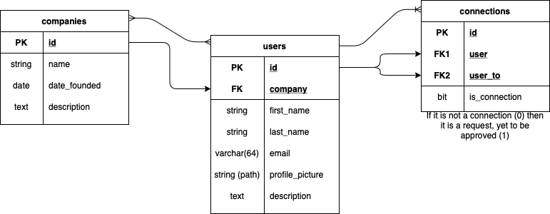
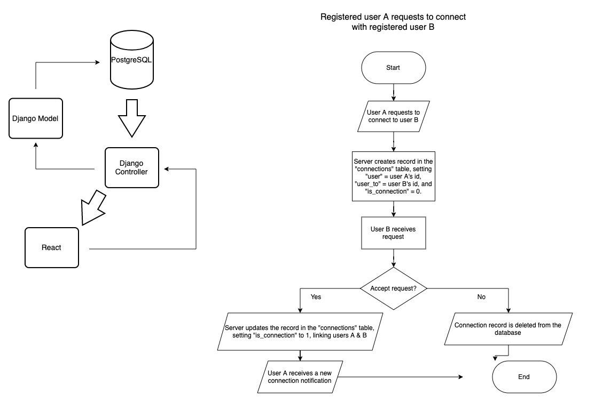

<h1>Graf-us | Analysis Tool</h1>

Data analysis and visualisation of people for companies to pick and choose who to contact.

Analysis of companies, visits, information, revenue, etc...

Website and mobile application to be built, first mobile application using Flutter,
then edit the CSS and HTML files to build on the generated website.

<h2> How to run /h2>
  
 Clone Repo 

  
 cd to frontend 

  
 run 'npm install' 

  
 run 'npm start' 

  
 start coding 

Example of undirected graph with dense edges to be used as the data structure for people/companies:

For the visualisation, when a node is hovered over, display basic information. 
To be made with nodes that hold data and information about the nodes it links with.

<h2>Tools</h2>
<ul>
  <li><a href="https://docs.docker.com">Docker</a></li>
  <li>JavaScript (<a href="https://reactjs.org">React</a>, <a href="https://d3js.org">D3.js</a>, Node.js)</li>
  <li>Python (<a href="https://docs.djangoproject.com/en/3.2/">Django</a>, <a href="https://matplotlib.org">Matplotlib</a>/<a href="https://pandas.pydata.org">Pandas</a>)</li>
  <li>GraphQL (<a href="https://graphql.org/code/#python">Graphene</a>)</li>
  <li><a href="https://www.postgresql.org">PostgreSQL</a></li>
  <li>RESTful APIs (unless we use a DBMS)</li>
</ul>

<a href="https://www.geeksforgeeks.org/how-to-connect-django-with-reactjs/">Connect Django with ReactJS</a>

<h2>Domain ideas (if needed)</h2>

graf-us.com - £0.99

graf-us.co.uk - £0.01

graphs.network - £4.53

<h4>Something that is needed</h4>

<h4>Something that is not currently available in the proposed form</h4>

<h4>State your case - why is this a good project? What value does it add?</h4>

## Basic Structure
 

## Flowchart connection
 
